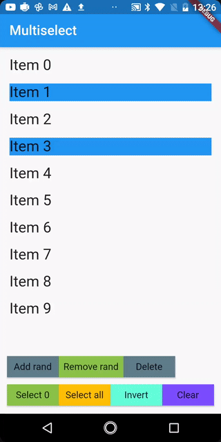

# multiselect_scope

Package for multiple selection and tracking selected items (select all, clear, invert selection, etc.)

## Getting Started



## Usage

1. Create `MultiselectController` if you need to manage selection outside `MultiselectScope`. 
```dart
final multiselectController = MultiselectController();
```

2. Wrap your multichild widget (`ListView` or `GridView` or another) in `MultiselectScope`. Pass to `dataSource` list of domain objects (`Cars` or `Employes` for example). Do not forget pass domain type to generic parameter (`MultiselectScope<String>` if domain type is `String`). Now let's look at the comments in the code 
```dart
MultiselectScope<String>(
  controller: multiselectController,
  dataSource: items,
  // Set this to true if you want automatically 
  // clear selection when user tap back button
  clearSelectionOnPop: true,
  // When you update [dataSource] then selected indexes will update
  // so that the same elements in new [dataSource] are selected
  keepSelectedItemsBetweenUpdates: true,
  initialSelectedIndexes: [1, 3],
  // Callback that call on selection changing
  onSelectionChanged: (indexes, items) {

  },
  child: ListView.builder(
      itemCount: items.length,
      itemBuilder: (context, index) {
        // Getting link to controller  
        final controller = MultiselectScope.controllerOf(context);

        final itemIsSelected = controller.isSelected(index);

        return InkWell(
          // You may implement selection logic as you want
          // For example start selection mode on long tap  
          onLongPress: () {
            if (!controller.selectionAttached) {
              controller.select(index);
            }
          },
          onTap: () {
            if (controller.selectionAttached) {
              controller.select(index);
            }
          },
          child: Padding(
            padding: const EdgeInsets.all(8.0),
            child: Container(
              // Colorize item depend on selected it or not 
              color: itemIsSelected ? Theme.of(context).primaryColor : null,
              child: Text(
                items[index],
                style: TextStyle(fontSize: 22),
              ),
            ),
          ),
        );
      }),
)
      

```

3. Control you selection

Get link to your controller inside scope:
```dart
final controller = MultiselectScope.controllerOf(context);
```
if your want to use controller outside scope that get link that you create before (`multiselectController`)

Manage selection:
```dart
multiselectController.selectAll();
multiselectController.select(0);
multiselectController.invertSelection();
multiselectController.clearSelection();
multiselectController.setSelectedIndexes([1,2,3]);
 
```

4. Get selected items
```dart
final selectedItems = multiselectController.getSelectedItems().cast<String>();
```  

or check item is selected:

```dart
final itemIsSelected = controller.isSelected(index);
```                          
 
